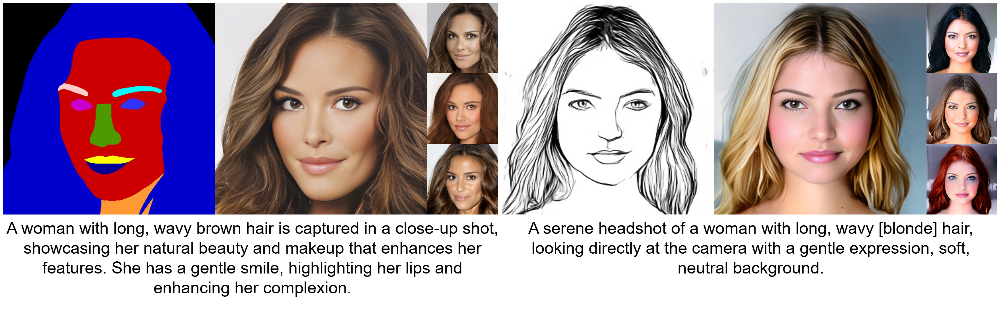
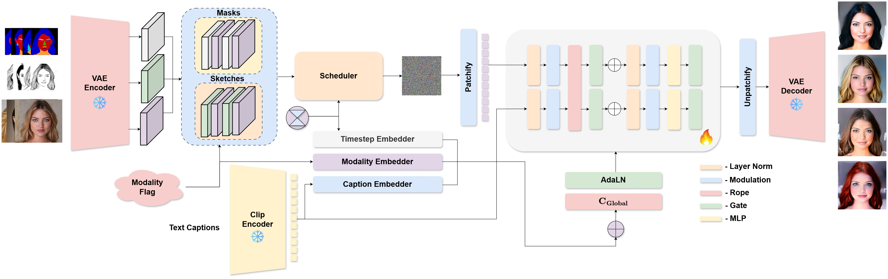
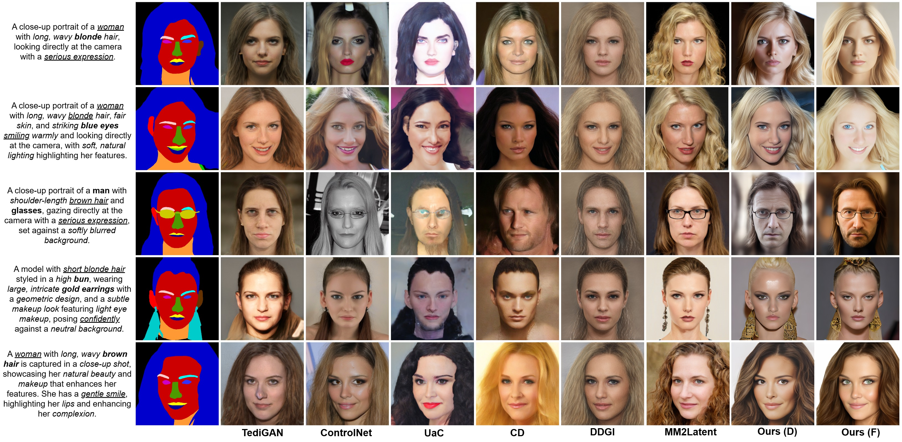
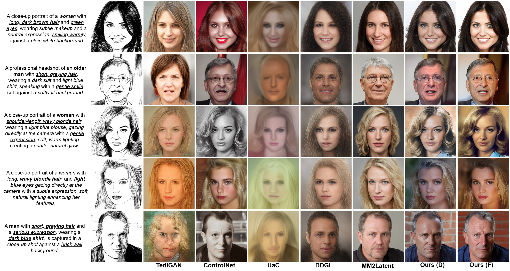

# MMFace-DiT: A Dual-Stream Diffusion Transformer for High-Fidelity Multimodal Face Generation

[](https://cvpr.thecvf.com/)
[](https://vcbsl.github.io/MMFaceDiT_Project_Page/) 
[](https://huggingface.co/BharathK333/MMFace-DiT-Models)
[](https://huggingface.co/spaces/BharathK333/MMFace-DiT) 
[](https://huggingface.co/datasets/BharathK333/MMFace-DiT-Dataset) 
[](https://opensource.org/licenses/MIT)

**Authors:** Bharath Krishnamurthy and Ajita Rattani  
**Affiliation:** University of North Texas, Denton, Texas, USA  

_Accepted to IEEE/CVF Conference on Computer Vision and Pattern Recognition (CVPR 2026)_

  
*MMFace-DiT synthesizes photorealistic portraits from multi-modal inputs, blending semantic text and precise physical control conditions like masks or edge sketches.*

---

## Overview

Recent multimodal face generation models address the spatial control limitations of text-to-image diffusion models by augmenting text-based conditioning with spatial priors such as segmentation masks, sketches, or edge maps. This multimodal fusion enables controllable synthesis aligned with both high-level semantic intent and low-level structural layout.

Most existing approaches typically extend pre-trained text-to-image pipelines by appending auxiliary control modules or stitching together separate uni-modal networks. These ad hoc designs inherit architectural constraints, duplicate parameters, and often fail under conflicting modalities or mismatched latent spaces.

**MMFace-DiT** introduces a unified **dual-stream diffusion transformer** engineered for synergistic multimodal face synthesis. Its core novelty lies in a dual-stream transformer block that processes multiple conditioning modalities natively in a cohesive generator backbone, seamlessly fusing spatial and semantic guidance.


*Architecture of our Dual-Stream DiT natively processing image, text, and condition latent streams.*

## Key Features

- **High-Fidelity Synthesis**: Generates photorealistic diverse portraits from multi-modal inputs.
- **Unified Dual-Stream DiT**: Replaces traditional U-Net backbones or auxiliary adapters with a natively multimodal transformer.
- **Versatile Control**: Enables fine-grained generation using diverse conditions such as:
  - Text Prompts
  - Semantic Maps / Masks
  - Edge Maps / Sketches
- **Multiple Paradigms**: Provides both Diffusion and Rectified Flow Matching (Flow) paradigms.

---

## Qualitative Results

### Mask Conditioning
By applying dense semantic masks, MMFace-DiT maps explicit features to diverse identities.



### Sketch (Edge-Map) Conditioning
Using sparsely defined edge-map sketches restricts boundaries but permits high identity variance.



---

## Repository Structure

The codebase is engineered professionally for usability and scale:

- `configs/`: Hyperparameter settings and YAML configuration documents for `diffusion/` and `flow/` architectures at 256px and 512px resolutions.
- `models/`: The core model architectures holding the `model_dual_stream_unified.py` components.
- `scripts/`: Specialized scripts for data engineering, like `precompute_latents_diffusion.py`, to accelerate the training loops.
- `utils/`: Re-useable PyTorch layers and processing functionality like `rope_embedding.py` and schedulers.
- **Main Handlers** (`train_*.py` , `sample_*.py`): Found at the root directory, these are the immediate entry points for users.

### File Highlights
- `train_diffusion_512.py`: Example training logic supporting 512px models under Diffusion modes.
- `sample_diffusion.py`: Example inference scripts natively supporting classifier-free guidance, mask, and sketch conditioning.

## Setup and Dependencies

This project relies on PyTorch, Hugging Face `diffusers`, `transformers`, `accelerate`, and other standard requirements for diffusion model pipelines. Use the standard PyTorch environments suitable for your hardware setups. Local Hugging Face fallbacks are integrated to avoid connection issues during training or inference.

---

## 🛠️ Environment Setup

To get started, clone the repository and set up the environment:

```bash
# Create a new conda environment
conda create -n MMDiT python=3.10
conda activate MMDiT

# Install dependencies
pip install -r requirements.txt
```

---

## 📂 Project Directory Structure

For inference and training to work correctly with the provided configurations, ensure the model checkpoints and datasets are organized as follows in the project root:

```text
MMFace-DiT/                                                                                                
├── Datasets/                                                                                              
│   ├── Celeb_Dataset/                                                                                     
│   │   └── Celeb_Final/                                                                                  
│   │       ├── train/ (masks, sketches, images)                                                           
│   │       └── test/ (masks, sketches, images)                                                            
│   ├── Celeb_Captions_Final/                                                                              
│   ├── FFHQ/                                                                                              
│   │   ├── Masks_Colored_1024/ 
│   │   └── sketches/
│   └── FFHQ_Captions_Final/ 
├── models/ 
|   ├── dit-unified-flux-vae-256/
|   │   └── checkpoint-440700/
|   │       └── dit_model_weights_ema.safetensors
|   ├── dit-unified-flux-vae-256-rfm/
|   │   └── checkpoint-283517/
|   │       └── dit_model_weights_ema.safetensors
|   ├── dit-unified-flux-vae-512-rfm/
|   │   └── checkpoint-44070/
|   │       └── dit_model_weights_ema.safetensors
├── VAE/
│   ├── config.json
│   └── diffusion_pytorch_model.safetensors
└── stable-diffusion-2-1-base/
|   ├── feature_extractor/
|   ├── scheduler/
|   ├── text_encoder/
|   ├── tokenizer/
|   └── vae/
```

*Note:* Please ensure to download the original RGB image for both Celeb and FFHQ datasets from the official sources. Additionally, the optimizer and scheduler states are also provided to resume training or further experimentation. Please note that the weights are needed for inference. 

---

## Flow

### Precompute Latents
```bash
python precompute_latents_unified.py --config_path config_256_unified.yml --resolutions 256

python precompute_latents_unified.py --config_path config_512_unified.yml --resolutions 512
```

### Training
```bash
NCCL_P2P_DISABLE="1" NCCL_IB_DISABLE="1" NCCL_CUMEM_ENABLE=0 accelerate launch --num_processes=2 train_flow_256.py --config_path configs/flow/config_256_unified_rfm.yml

NCCL_P2P_DISABLE="1" NCCL_IB_DISABLE="1" NCCL_CUMEM_ENABLE=0 accelerate launch --num_processes=2 train_flow_512.py --config_path configs/flow/config_512_unified_rfm.yml

NCCL_P2P_DISABLE="1" NCCL_IB_DISABLE="1" NCCL_CUMEM_ENABLE=0 accelerate launch --num_processes=2 train_flow_512_optimized.py --config_path configs/flow/config_512_unified_rfm_optimized.yml
```

### Sampling

#### DEFAULT COMMANDS FOR MASK AND SKETCH CONDITIONING WITH RFM:
```bash
python sample_flow.py \
  --config_path "configs/flow/config_256_unified_rfm.yml" \
  --weights_path "dit-unified-flux-vae-256-rfm/checkpoint-283517/dit_model_weights_ema.safetensors" \
  --modality "mask" \
  --conditioning_path "Datasets/Celeb_Dataset/Celeb_Final/test/masks/5.png" \
  --prompt "A stunning young woman with long, wavy blonde hair, wearing a silver, intricate earring, and blue eyes, exudes confidence and elegance. Her expression is soft and contemplative, set against a neutral, soft-focus background." \
  --output_dir "Samples/Flow/Generated_Samples_Masks" \
  --num_samples 4 \
  --guidance_scale 7.5 \
  --num_inference_steps 50 \
  --seed 42 \
  --mixed_precision "bf16"

python sample_flow.py \
  --config_path "configs/flow/config_256_unified_rfm.yml" \
  --weights_path "dit-unified-flux-vae-256-rfm/checkpoint-283517/dit_model_weights_ema.safetensors" \
  --modality "sketch" \
  --conditioning_path "Datasets/Celeb_Dataset/Celeb_Final/test/sketches/5.png" \
  --prompt "A stunning young woman with long, wavy blonde hair, wearing a silver, intricate earring, and blue eyes, exudes confidence and elegance. Her expression is soft and contemplative, set against a neutral, soft-focus background." \
  --output_dir "Samples/Flow/Generated_Samples_Sketches" \
  --num_samples 4 \
  --guidance_scale 7.5 \
  --num_inference_steps 50 \
  --seed 42 \
  --mixed_precision "bf16"
```

#### Progressive
```bash
python sample_flow.py \
  --config_path "configs/flow/config_512_unified_rfm.yml" \
  --weights_path "dit-unified-flux-vae-512-rfm/checkpoint-44070/dit_model_weights_ema.safetensors" \
  --modality "mask" \
  --conditioning_path "Datasets/Celeb_Dataset/Celeb_Final/test/masks/5.png" \
  --prompt "A stunning young woman with long, wavy blonde hair, wearing a silver, intricate earring, and blue eyes, exudes confidence and elegance. Her expression is soft and contemplative, set against a neutral, soft-focus background." \
  --output_dir "Samples/Flow/Progressive_Generations_Mask" \
  --num_samples 4 \
  --guidance_scale 7.5 \
  --num_inference_steps 50 \
  --seed 42 \
  --mixed_precision "bf16"

python sample_flow.py \
  --config_path "configs/flow/config_512_unified_rfm.yml" \
  --weights_path "dit-unified-flux-vae-512-rfm/checkpoint-44070/dit_model_weights_ema.safetensors" \
  --modality "sketch" \
  --conditioning_path "Datasets/Celeb_Dataset/Celeb_Final/test/sketches/5.png" \
  --prompt "A stunning young woman with long, wavy blonde hair, wearing a silver, intricate earring, and blue eyes, exudes confidence and elegance. Her expression is soft and contemplative, set against a neutral, soft-focus background." \
  --output_dir "Samples/Flow/Progressive_Generations_Sketches" \
  --num_samples 4 \
  --guidance_scale 7.5 \
  --num_inference_steps 50 \
  --seed 42 \
  --mixed_precision "bf16"
```

---

## Diffusion

### Training
```bash
NCCL_P2P_DISABLE="1" NCCL_IB_DISABLE="1" NCCL_CUMEM_ENABLE=0 accelerate launch --num_processes=2 train_diffusion_256.py --config_path configs/diffusion/config_256_unified.yml

NCCL_P2P_DISABLE="1" NCCL_IB_DISABLE="1" NCCL_CUMEM_ENABLE=0 accelerate launch --num_processes=2 train_diffusion_512.py --config_path configs/diffusion/config_512_unified.yml
```

### Sampling

#### DEFAULT COMMANDS FOR MASK AND SKETCH CONDITIONING WITH DIFFUSION:
```bash
python sample_diffusion.py \
  --config_path "configs/diffusion/config_256_unified.yml" \
  --weights_path "dit-unified-flux-vae-256/checkpoint-440700/dit_model_weights_ema.safetensors" \
  --modality "mask" \
  --conditioning_path "Datasets/Celeb_Dataset/Celeb_Final/test/masks/5.png" \
  --prompt "A stunning young woman with long, wavy blonde hair, wearing a silver, intricate earring, and blue eyes, exudes confidence and elegance. Her expression is soft and contemplative, set against a neutral, soft-focus background." \
  --output_dir "Samples/Diffusion/Generated_Samples_Masks" \
  --num_samples 4 \
  --guidance_scale 7.5 \
  --num_inference_steps 50 \
  --seed 42 \
  --mixed_precision "bf16"

python sample_diffusion.py \
  --config_path "configs/diffusion/config_256_unified.yml" \
  --weights_path "dit-unified-flux-vae-256/checkpoint-440700/dit_model_weights_ema.safetensors" \
  --modality "sketch" \
  --conditioning_path "Datasets/Celeb_Dataset/Celeb_Final/test/sketches/5.png" \
  --prompt "A stunning young woman with long, wavy blonde hair, wearing a silver, intricate earring, and blue eyes, exudes confidence and elegance. Her expression is soft and contemplative, set against a neutral, soft-focus background." \
  --output_dir "Samples/Diffusion/Generated_Samples_Sketches" \
  --num_samples 4 \
  --guidance_scale 7.5 \
  --num_inference_steps 50 \
  --seed 42 \
  --mixed_precision "bf16"
```

---

### Citation
If you find this work helpful for your research, please cite our CVPR paper:

```bibtex
@inproceedings{krishnamurthy2026mmfacedit,
  title     = {MMFace-DiT: A Dual-Stream Diffusion Transformer for High-Fidelity Multimodal Face Generation},
  author    = {Krishnamurthy, Bharath and Rattani, Ajita},
  booktitle = {Proceedings of the IEEE/CVF Conference on Computer Vision and Pattern Recognition (CVPR)},
  year      = {2026}
}
```